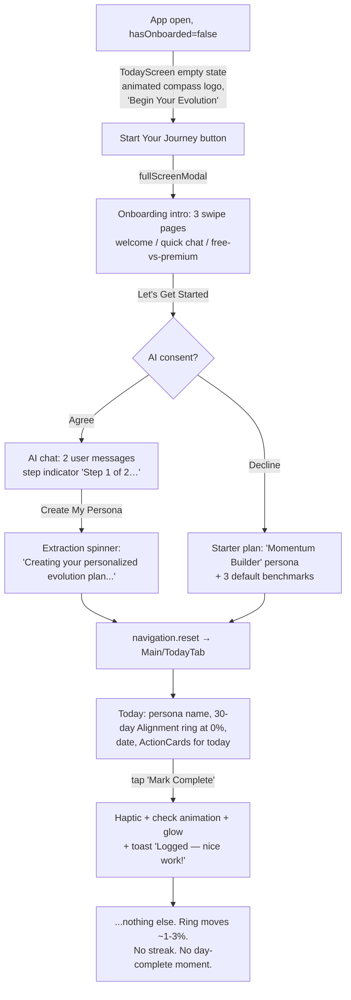

# Resolution Companion AI — UX Redesign Proposal
### Making progress visible, the loop coherent, and logging sticky

**Author:** Product design review (habit-formation / retention specialty)
**Date:** 2026-07-07
**Scope:** `client/` — grounded in the code as implemented. Recent fixes (post-onboarding lands on Today, Next Steps card, frequency badges, inline score explanations, log toast, softened coach upsell, memoization) are treated as shipped and not re-proposed.

---

## 1. Current-State Flow Map

### 1.1 First run: onboarding → plan → first log



What the user sees at each hop:

| Hop | Screen | Feedback given |
|---|---|---|
| Cold open | `TodayScreen.tsx:300-329` empty state | Animated logo, "Define who you are becoming…" — good identity framing |
| Intro | `OnboardingScreen.tsx:92-156` `INTRO_PAGES` | 3 static pages; page 3 is a **pricing pitch before the user has felt any value** |
| Chat | `OnboardingScreen.tsx:324-375` | Streaming AI, step progress bar. Conversation hard-capped at 2 user messages (`messageCount.current >= 2`, line 364) |
| Plan created | `OnboardingScreen.tsx:414-424` reset to TodayTab | Success haptic only. **The user never sees the plan the AI built** before landing on Today — benchmarks/actions appear as cards with unexplained "Anchor"/zap labels. The Next Steps explainer lives on the *Progress* tab (`ProgressScreen.tsx:165-215`), which the user may not visit for days |
| First log | `ActionCard.tsx:63-75`, `TodayScreen.tsx:273-286` | Haptic, check bounce, green glow, toast. Then silence |

### 1.2 The daily loop (as implemented)

```
Open app
  └─ Today tab (initialRouteName, MainTabNavigator.tsx:61)
       ├─ Sees: "Becoming {persona.name}" header (TodayScreen.tsx:342-349)
       ├─ Sees: CircularProgress ring = 30-DAY alignment (TodayScreen.tsx:351-362)
       │        ← the slowest-moving number in the app is the hero element
       ├─ Sees: date + "{n} actions today" + tab badge with remaining count
       │        (MainTabNavigator.tsx:40-57, pink badge)
       ├─ Logs: ActionCard toggle → haptic + animation + toast
       │        30-day ring recomputes via useMemo (AppContext.tsx:94-97)
       │        but moves ~1-3% per log — visually imperceptible
       ├─ All done → badge disappears. Cards all say "Completed".
       │        NO closure moment, NO streak update, NO tomorrow hook
       └─ 7-day Momentum score: NOT SHOWN HERE AT ALL.
          It renders only on the Coach tab (ReflectScreen.tsx:454-475).
```

### 1.3 Weekly / monthly loop

- **Weekly:** none exists. No recap, no summary, no notification. The 7-day Momentum score exists (`AppContext.tsx:90-93`) but only surfaces on the Coach landing screen.
- **Calendar review (ad hoc):** Calendar tab shows a month grid with complete/partial/missed dots and a subtle streak connector line (`CalendarScreen.tsx:339-343, 507-514`), a tappable day detail that is a **second full logging surface** (`SelectedDateDetails`, lines 67-209), and then a duplicated "Benchmark Progress" list (lines 602-628) that also appears on the Progress tab.
- **Monthly:** Coach tab → "Review Monthly Progress" → AI chat seeded with momentum context (`ReflectScreen.tsx:127-188`) → Save. 10 free/month; upsell link appears at ≥7 used (line 507).

### 1.4 Upgrade path

- Coach: limit-reached button routes to `Subscription` modal (`ReflectScreen.tsx:96-99, 509`).
- Profile: "Add persona" beyond 1 gated (`AppContext.tsx:378-381`), Add-benchmark gated entirely to premium (`canAddBenchmark`, line 383-385) — note the Progress tab shows an ungated-looking "+ Add" button (`ProgressScreen.tsx:232-245`) whose gate lives inside the editor.
- Onboarding intro page 3 pitches premium pre-value.

---

## 2. Diagnosis: Why It Feels Disjointed

Each candidate cause evaluated against the code. Verdicts: **CONFIRMED / PARTIAL / REJECTED**.

### 2.1 Five tabs split one loop across surfaces — CONFIRMED
The core loop is *log → see progress → feel closer to the persona*. Today it is spread across four tabs:
- Log on **Today** (`TodayScreen`) or **Calendar** (`SelectedDateDetails` — a duplicate logging UI with different visuals, line-through text instead of the ActionCard button).
- Rolling benchmark % on **Progress** (`ProgressScreen.tsx:62-71`) *and again* on **Calendar** (`CalendarScreen.tsx:387-396, 602-628`) — literally the same `computeBenchmarkProgress` call rendered twice.
- 7-day Momentum only on **Coach** (`ReflectScreen.tsx:454-475`).
- 30-day Alignment on **Today** (`TodayScreen.tsx:351-362`) *and* **Progress** (`ProgressScreen.tsx:217-228`).

No screen owns the loop; every screen owns a fragment, and two fragments are duplicated. That is the mechanical definition of "disjointed."

### 2.2 Progress feedback lives away from the logging action — PARTIAL, and worse than it looks
Today *does* show a ring, so on paper progress is co-located with logging. But it's the **30-day** window: with ~4 actions/day, one completion moves it by well under 1.5 points. `CircularProgress` animates with a spring (`CircularProgress.tsx:51-66`), so a sub-2% change is a pixel-level twitch. The score that *would* move satisfyingly per log — the 7-day Momentum (~3-5 points per action) — is exiled to the Coach tab. **The fast-feedback metric is on the screen where nothing is logged, and the slow metric is on the screen where everything is logged.** This inversion is the single biggest reason logging feels unrewarding.

### 2.3 Two scores, two windows, no shared narrative — CONFIRMED
`momentumScore` and `personaAlignment` are the *same function with a different day count* (`AppContext.tsx:90-97` calling `computeMomentumScore(actions, dailyLogs, 7)` and `(…, 30)`). Yet the UI names them as if they were different concepts: "Momentum" (Coach), "Persona Alignment" (Today ring label), "30-Day Alignment" (Progress ring label). Three labels, two windows, one formula. Users cannot build a mental model of two near-identical percentages that disagree with each other.

**Bonus defect — the morning penalty:** `computeMomentumScore` includes *today* in the window (`progress.ts:165-180`, loop starts at `i = 0`). Today's scheduled actions count as *expected* from midnight, so a perfectly consistent user opens the app at 8 AM and sees their score **lower than last night** (e.g. 86% instead of 100% for a daily action) purely because they haven't logged yet. The first feedback of the day is a demotion. Same flaw in `storage.calculateMomentumScoreForPersona` (`storage.ts:235-259`).

### 2.4 Calendar / Progress / Today overlap — CONFIRMED
Detailed in 2.1. Additionally both Progress and Calendar screens independently re-derive `personaBenchmarks`, `personaCreatedDate`, `benchmarkProgress` (`ProgressScreen.tsx:36-71` vs `CalendarScreen.tsx:268-396`) — the duplication is structural, not just visual.

### 2.5 No end-of-day closure moment — CONFIRMED
When the final action is toggled, the only state consequences are: the toast fires (`TodayScreen.tsx:277-280`, same copy as every other log), and the tab badge unmounts (`MainTabNavigator.tsx:140-141`). `handleToggle` never checks whether the day is now complete. The "rest and recharge" card renders **only when zero actions were scheduled** (`TodayScreen.tsx:378-426`), never when all were completed. The day just… stops. No peak-end moment, no "come back tomorrow" hook (the tomorrow-preview link exists but only inside the no-actions-scheduled branch, lines 397-425).

### 2.6 No streak or milestone celebration — CONFIRMED
The word "streak" appears once in the UI: a 2px connector line between consecutive fully-complete days on the calendar grid (`CalendarScreen.tsx:339-343, 695-701`) — invisible unless you know to look. No streak counter exists anywhere in `progress.ts`, `AppContext`, or any screen. Benchmarks can never celebrate: `Benchmark.status: "active" | "completed"` exists in the schema (`storage.ts:33`) but **no code path ever sets `"completed"`** — it's a dead field. `targetDate` is likewise always `null` from onboarding (`OnboardingScreen.tsx:275`).

### 2.7 Benchmark "progress" doesn't match the milestone mental model — CONFIRMED
`computeBenchmarkProgress` (`progress.ts:86-143`) is a **rolling 30-day adherence rate**, not progress toward a milestone. Consequences the user will experience as bugs:
- The number **goes down** when a scheduled day passes unlogged, even with months of prior effort.
- It can never "finish" — a benchmark at 100% today can be 93% Thursday.
- Perfect users are capped: your benchmark is "80%" forever if you complete 4 of 5 scheduled days weekly.
- The status dot paints < 50% **error-red** (`ProgressScreen.tsx:266-276`) — guilt-coded UI on the brand's flagship "milestones."

This violates the goal-gradient effect (no gradient — the goalpost moves with you) and the endowed-progress effect (progress can be *taken away*).

### 2.8 Jargon layering — CONFIRMED
One action card simultaneously exposes: benchmark title (uppercase cyan), action title, a zap-icon "kickstart version" with no label, and a boxed "Anchor" label (`ActionCard.tsx:118-168`). Around the app: "Target Persona," "Becoming," "benchmark," "elemental action" (type name leaks into editor screens), "kickstart," "anchor," "Momentum," "Persona Alignment," "30-Day Alignment," and the Coach tab is titled "Coach" but its screen says "AI Coaching," the session header says "Reflection," and the file is `ReflectScreen`. Five internal concept names is roughly three more than a habit app can carry.

### 2.9 Additional findings (not in the brief's candidate list)
- **Notifications are a blunt instrument:** one fixed 8:00 PM daily reminder with generic copy ("Have you logged your actions today?"), opt-in buried in Profile (`notifications.ts:49-83`, `ProfileScreen.tsx:213-274`). It fires even when the day is already complete, and never references the user's persona, streak, or anchor habits — despite every action carrying an `anchorLink` ("After I sit down at my desk") that is a ready-made implementation-intention trigger.
- **Tab badge is negatively framed:** a pink count of *unfinished* tasks (`MainTabNavigator.tsx:140-149`) — a nag, not a pull.
- **Toast copy is static** ("Logged — nice work!") — no variable reward, no delta.

---

## 3. The Optimum Flow

### 3.1 Design thesis

One sentence: **Today is the loop; everything else supports it.** The user should never need a second screen to answer "did that log matter?"

The core loop, redesigned:

```
OPEN ──► SEE TODAY CLEARLY ──► LOG ──► PROGRESS MOVES ON-SCREEN ──► DAY COMPLETE ──► REASON TO RETURN
 │            │                  │             │                        │                  │
 │      Today Ring (0/3)    tap card     ring fills 1/3→2/3      celebration card    tomorrow preview,
 │      streak chip,        haptic +     +"A vote for            streak +1, glow,    streak at stake,
 │      today's cards       animation    {persona}" toast        momentum delta      smart notification
 └─ notification deep-links here (anchor-timed, streak-aware)
```

**The metric hierarchy** (one narrative, three time horizons):

| Horizon | Metric | Where | Story it tells |
|---|---|---|---|
| Today | **Today Ring** — `completedToday / scheduledToday` | Hero of Today screen | "Close the ring" — finishable every single day |
| Week | **Momentum** — existing 7-day score, fixed to exclude today's unlogged | Chip under the ring; Coach; weekly recap | "Am I in rhythm?" |
| Month+ | **Alignment** — existing 30-day score, renamed "Consistency" trend | Journey tab only, as a sparkline/trend, not a hero ring | "Is the identity sticking?" |
| Identity | **Streak (with grace)** + milestone completions | Chip on Today; celebrated at thresholds | "I am becoming {persona}" |

The daily ring is the *only* number that must move visibly per log — and it moves by 33% per tap on a 3-action day. That alone repairs the feedback loop.

### 3.2 Information architecture: 5 tabs → 3 tabs

| New tab | Contains | What moves here |
|---|---|---|
| **Today** (sun icon) | Today Ring, streak chip, momentum chip, action cards, day-complete state, tomorrow preview | 30-day ring *removed* from Today |
| **Journey** (map icon) | Persona card → milestone path (benchmarks) → month calendar grid → consistency trend | Merges Progress + Calendar. Calendar's duplicate benchmark list and duplicate logging UI are deleted; day-tap shows a read-only day summary with an "edit this day" affordance for backfill |
| **Coach** (message icon) | Unchanged check-in flow; gains "weekly recap" cards and becomes the re-engagement surface | Momentum stays here too (consistent with everywhere else) |

**Profile** becomes a gear icon in the Today/Journey header opening the existing `ProfileScreen` as a modal (it's settings, not a daily destination — nothing in it is part of any loop). The Coach tab keeps its elevated center-button styling (`MainTabNavigator.tsx:166-182`).

Why not keep Calendar as a tab: its unique value (backfill + month-at-a-glance) is a weekly-frequency job, not a daily one, and its presence forces the duplicated logging/progress surfaces documented in 2.4. As a section of Journey it retains 100% of function with 0% of the split.

### 3.3 Milestone semantics: from rolling % to consistency targets

Replace the rolling-window benchmark % with a **fill-only consistency target**:

> A benchmark completes when its action has been logged on **21 scheduled days** (default; AI or user can set 10–40 per benchmark difficulty).

- Progress = `lifetimeCompletedScheduledDays / target` — **monotonically increasing**. Endowed progress is never revoked.
- Completing a benchmark finally uses the dead `status: "completed"` field (`storage.ts:33`) and triggers a milestone celebration; a completed benchmark's action either graduates ("habit locked in — keep it or retire it") or the AI proposes the next benchmark — the natural premium/coach hook.
- The Journey tab renders benchmarks as a **vertical path toward the persona**: completed milestones (filled nodes) → current milestone (ring with x/21) → future milestones (dimmed) → persona name at the summit. This matches the stated mental model ("progressing toward a milestone") and creates a goal gradient: nodes get visually closer to the identity.
- The 30-day adherence number survives as the "Consistency" trend line — useful signal, honest name, demoted from hero to context.

### 3.4 Supporting loops

- **Weekly (new):** Monday-morning recap card at the top of Today (dismissable): last week's momentum vs. prior, best day, streak status, one-line AI-free templated insight. Sunday-evening variant if the week is one log away from beating the previous one (goal-gradient nudge).
- **Monthly (existing, better fed):** Coach check-in unchanged, but seeded additionally with streak, milestone completions, and grace-days used (extend `getMonthlyContext`) so the coach can reference the same narrative the UI shows.
- **Milestones (new):** benchmark completion celebration (3.3).

---

## 4. UI Design Spec

### 4.1 Today (redesigned) — `client/screens/TodayScreen.tsx`

Layout, top → bottom:

1. **Header row:** small "BECOMING" eyebrow + persona name (keep `TodayScreen.tsx:342-349` styles) — right-aligned gear icon → Profile modal (Phase 2).
2. **Today Ring** — reuse `CircularProgress` (size 160), `progress = scheduledToday === 0 ? 100 : completedToday/scheduledToday*100`. Center text swaps from "%" to **"2/3"** fraction (small prop addition: `valueText?: string`). Label: `"Today"`. The existing ≥80% glow (`CircularProgress.tsx:55-59`) becomes the 100% payoff.
3. **Chip row** (new component `StatChip`, horizontal pair under ring):
   - 🔥 `"{n}-day streak"` — flame turns gray + copy `"Streak protected"` on a grace day.
   - ⚡ `"Momentum {m}%"` with tiny ▲/▼ vs. yesterday.
4. **Date row** — keep (`TodayScreen.tsx:364-376`).
5. **Action cards** — keep `ActionCard` with microcopy relabels:
   - Zap line gets a label: **"Too busy? Just:"** before `kickstartVersion` — the 2-minute fallback is the app's best Fogg-ability feature and currently unlabeled.
   - "Anchor" label → **"When:"** (`ActionCard.tsx:157-160`).
   - Completed card collapses to a single compact row (title + check) to visually clear the deck as the day progresses.
6. **States:**
   - *Empty (no actions scheduled):* keep the rest-day card; **always** show tomorrow preview (move it out of the zero-scheduled-only branch, `TodayScreen.tsx:397-425`).
   - *Partial:* ring shows fraction; remaining cards full-size on top, completed collapsed below.
   - *Complete:* see 4.2.
7. **Toast copy on log** (replace static string at `TodayScreen.tsx:278`): rotate through identity-framed variants — `"A vote for {persona.name} ✓"`, `"Momentum +{delta}%"`, `"{remaining} to go — ring's filling up"`; final action uses the celebration instead.

**Haptics:** keep existing per-card success notification (`ActionCard.tsx:69-73`); add `Haptics.notificationAsync(Success)` + a second `impactAsync(Heavy)` 300ms later for the day-complete moment (double-tap pattern reads as "event," not "acknowledgment").

### 4.2 Day-Complete celebration (new component `DayCompleteCard`)

Trigger: in `handleToggle` (`TodayScreen.tsx:273-286`), after `toggleDailyLog` resolves, compute `remaining`; if it just hit 0, set `dayComplete = true` (also derive on mount so reopening the app shows the completed state, not the animation).

Design (inline card replacing the action list, not a blocking modal — respect the 10-second user):

```
┌──────────────────────────────────┐
│         (ring pulses to 100%,    │
│          glow, 4 accent dots     │
│          burst outward — reuse   │
│          reanimated, no deps)    │
│                                  │
│         Day complete.            │
│   That's {streak} days of        │
│   becoming {persona.name}.       │
│                                  │
│   ⚡ Momentum {m}%  (+{d} today) │
│                                  │
│   Tomorrow: {n} actions ·        │
│   {first action title} →         │
└──────────────────────────────────┘
```

Microcopy rules: never "perfect day" (sets up failure framing); always identity-referential; always ends with tomorrow (the return hook). First-ever completion gets a one-time extra line: `"This is how it starts."` Animation: ring spring to 100 (existing), card fade/slide-in via reanimated `withDelay`, dot burst = 6 absolutely-positioned dots with spring translate + fade (pattern already exists in `StylizedAppLogo`'s gradient dots, `TodayScreen.tsx:121-152`).

### 4.3 Streak mechanics (new: `computeStreak` in `client/lib/progress.ts`)

Rules — identity-brand, not streak-guilt:

- A calendar day **counts** if all scheduled actions that day were completed.
- A day with **no scheduled actions is free** — it can never break a streak (the schedule is the contract; rest days are part of the plan).
- **Grace ("Streak Shield"):** one missed scheduled day per rolling 7 does not break the streak. It is *bridged and disclosed*: chip shows shield icon + "Streak protected," and the calendar day renders with a shield-outline marker instead of the red "missed" ring (`CalendarScreen.tsx:522-527`). Two misses in 7 days → streak resets, copy stays warm: `"Fresh start — your longest run was {best}. It's still yours to beat."`
- **Today is pending, not broken:** today never breaks a streak until the day ends; the chip counts through yesterday and increments live when today completes.
- Store nothing — derive from `dailyLogs` + `actions` frequencies (same pure-function pattern as `computeMomentumScore`), plus `longestStreak` derivable in the same pass.

### 4.4 Journey tab (Phase 2, new screen merging Progress + Calendar)

Top → bottom:
1. **Persona summit card** — persona name/description (reuse `ProgressScreen.tsx:133-163` card).
2. **Milestone path** — vertical stepper: each benchmark node shows title, `x/21 days` fill (reuse `ProgressBar`), frequency badge (shipped), Edit affordance (reuse `ProgressScreen.tsx:295-316`). Completed nodes: filled check + completion date. Section header: **"Milestones"** (retire "Core Benchmarks" from user-facing copy).
3. **Month grid** — lift the calendar grid + day detail from `CalendarScreen` nearly as-is; day detail becomes read-only summary with an "Edit this day" toggle for backfill (keeps the honest-backfill feature, kills the parallel primary logging surface). Delete the duplicated "Benchmark Progress" section (`CalendarScreen.tsx:602-628`).
4. **Consistency trend** — 30-day score as a simple 8-week sparkline (new tiny component) with the shipped explainer line.

### 4.5 Coach tab — light touches only
- Keep flow; rename session header "Reflection" → **"Monthly Check-in"** (`ReflectScreen.tsx:654-657`) to match the entry button.
- Momentum hero (`ReflectScreen.tsx:454-475`) stays — now consistent with the chip on Today.
- Add streak + latest milestone to `getMonthlyContext` payload so the coach references them.

### 4.6 Copy glossary (single source of truth for jargon cleanup)

| Internal / current | User-facing everywhere |
|---|---|
| Target Persona | "who you're becoming" / persona name itself |
| Benchmark | **Milestone** |
| Elemental action | **Daily action** (or just "action") |
| Kickstart version | **"Too busy? Just:"** |
| Anchor link | **"When:"** |
| Persona Alignment / 30-Day Alignment | **Consistency** (trend, Journey only) |
| Momentum | **Momentum** (keep — it's the good one) |

---

## 5. Stickiness Mechanics — ranked by expected impact

1. **Same-screen progress + Today Ring** *(highest impact — repairs the broken reward step)*
   Principle: operant conditioning requires the reward to be immediate and perceptible; Fogg's B=MAP needs the "celebration" at the moment of behavior. Here: ring jumps 25-33% per log, chips tick, toast names the identity. Cost: small; uses existing components.

2. **Day-complete closure + tomorrow hook**
   Principle: peak-end rule (the session's last moment defines its memory) + Zeigarnik (open loop "tomorrow: 3 actions" pulls return). Here: `DayCompleteCard` (4.2). This is the single most under-leveraged moment in the current app — it literally does nothing today.

3. **Streak-with-grace**
   Principle: loss aversion sustains mid-term retention (Duolingo's most powerful lever), but a hard break causes churn-after-slip; grace ("streak freeze") measurably reduces post-miss abandonment. The identity brand demands forgiveness be *visible* (shield, warm reset copy), not silent. Here: 4.3, chip on Today, shield markers on the Journey calendar.

4. **Anchor-timed smart notifications**
   Principle: implementation intentions ("after I sit at my desk → breathe") roughly double follow-through vs. time-based nudges; the data is already collected per action (`anchorLink`) and completely unused by `notifications.ts`. Here:
   - Ask for permission **contextually after the first day-complete** ("Want a nudge tomorrow so the streak holds?") instead of cold in Profile.
   - Morning note referencing the anchor: `"After you check your phone: 2-min plan. The ring's waiting."`
   - Evening reminder (existing 8 PM) becomes conditional — **cancel it when the day is already complete** and make copy streak-aware: `"5 minutes to keep a 6-day streak alive."`
   - Content rotates (variable reward); never more than 2/day.

5. **Milestone celebrations at benchmark completion**
   Principle: goal-gradient + endowed progress need an actual endpoint; celebrations mark identity evidence ("you did the thing 21 times — that's a habit"). Here: 3.3 consistency targets, full-screen moment on completion, coach follow-up suggestion (soft premium hook that feels like a gift).

6. **Weekly recap card**
   Principle: reflection consolidates habit identity; comparative framing ("beat last week by 2 logs") adds a light competitive loop against oneself. Here: 3.4, templated (no AI cost), Monday on Today.

7. **Coach as re-engagement channel**
   Principle: personalized outreach recovers lapsed users better than generic reminders. Here: after 2 consecutive missed scheduled days, one notification voiced as the coach: `"Rough couple of days? Your plan can bend — want to make it easier?"` deep-linking to Coach with a friction-reduction prompt (suggest shrinking to kickstart versions). This reframes lapse as a plan problem, not a person problem — on brand, and it routes users toward the monetized surface at their most persuadable moment.

---

## 6. Implementation Roadmap

### Phase 1 — Quick wins, shippable this week (no navigation changes)

| # | Item | Files | Effort | Risk |
|---|---|---|---|---|
| 1.1 | **Today Ring**: swap Today's hero ring from `personaAlignment` to today's completion fraction; add `valueText` prop to `CircularProgress`; move the 30-day explainer text off Today | `client/screens/TodayScreen.tsx:351-362`, `client/components/CircularProgress.tsx` | S | Low — presentational; `todayActions` + `getLogForAction` already computed on-screen |
| 1.2 | **Fix the morning penalty**: in `computeMomentumScore`, exclude *today's unlogged* actions from `totalExpected` (count today only for completions). Mirror in `storage.calculateMomentumScoreForPersona` | `client/lib/progress.ts:153-185`, `client/lib/storage.ts:215-264,546-585` | S | Low-med — scores shift upward once; add unit tests for the day-boundary cases the file already documents |
| 1.3 | **`computeStreak` + chips**: pure function (rules in 4.3) + `StatChip` row on Today (streak + momentum) | `client/lib/progress.ts` (new fn), `client/components/StatChip.tsx` (new), `client/screens/TodayScreen.tsx` | M | Low — derived, no storage changes |
| 1.4 | **DayCompleteCard**: detect remaining==0 in `handleToggle` + on mount; celebration card per 4.2; double haptic; tomorrow preview reuses `tomorrowActions` (`TodayScreen.tsx:294-298`) | `client/components/DayCompleteCard.tsx` (new), `client/screens/TodayScreen.tsx:273-286` | M | Low — additive UI state |
| 1.5 | **Toast variants + momentum delta** (replace static "Logged — nice work!") | `client/screens/TodayScreen.tsx:277-280` | S | None |
| 1.6 | **Microcopy pass**: "Too busy? Just:" label, "Anchor"→"When:", "Core Benchmarks"→"Milestones", unify "Check-in" naming | `client/components/ActionCard.tsx:126-168`, `client/screens/ProgressScreen.tsx:231`, `client/screens/ReflectScreen.tsx:654-657` | S | None |
| 1.7 | **Notification upgrades**: contextual permission ask after first day-complete; streak-aware copy; skip/cancel evening reminder when day already complete (cancel-and-reschedule on day completion) | `client/lib/notifications.ts`, `client/screens/TodayScreen.tsx`, `client/screens/ProfileScreen.tsx:213-274` | M | Med — scheduling edge cases; keep Profile toggle as the master switch |
| 1.8 | **De-duplicate Calendar**: remove the "Benchmark Progress" section from Calendar (kept on Progress) | `client/screens/CalendarScreen.tsx:383-396,602-628` | S | None |
| 1.9 | **Tab badge reframe**: badge only before first log of the day (invite), hidden once the user has logged ≥1 (the ring takes over) | `client/navigation/MainTabNavigator.tsx:40-57,140-149` | S | None |

### Phase 2 — Flow / IA restructure (1–2 weeks)

| # | Item | Files | Effort | Risk |
|---|---|---|---|---|
| 2.1 | **3-tab IA**: new `JourneyScreen` merging Progress + Calendar per 4.4; remove Calendar/Progress/Profile tabs; Profile → header gear modal | `client/navigation/MainTabNavigator.tsx`, `client/navigation/RootStackNavigator.tsx`, `client/screens/JourneyScreen.tsx` (new), delete-or-fold `ProgressScreen`/`CalendarScreen` | L | Med — navigation params (`navigate("CalendarTab")`, `navigate("ProgressTab")` call sites in Today/Progress guide), deep-link targets, `useBottomTabBarHeight` consumers |
| 2.2 | **Milestone consistency targets**: add `targetDays` to `Benchmark` (default 21, backfill existing), progress = lifetime completed scheduled days; set `status:"completed"` at target; migration keeps old field defaults | `client/lib/storage.ts:28-35`, `client/lib/progress.ts:86-143`, `client/screens/JourneyScreen.tsx`, `client/screens/BenchmarkEditorScreen.tsx`, onboarding `savePlan` (`OnboardingScreen.tsx:266-295`) | L | Med — semantics change is user-visible; ship with a one-time "Milestones now fill up — they never go backwards" info card |
| 2.3 | **Post-onboarding plan reveal**: one screen between extraction and Today showing persona + milestone path ("Here's your plan — your first action is ready on Today") | `client/screens/OnboardingScreen.tsx:377-450` | M | Low |
| 2.4 | **Read-only day detail + explicit backfill mode** on Journey calendar | from `CalendarScreen.tsx:67-209` | S | Low |

### Phase 3 — Delight & retention layer

| # | Item | Files | Effort | Risk |
|---|---|---|---|---|
| 3.1 | Milestone completion celebration (full-screen moment, coach follow-up CTA) | `JourneyScreen`, new `MilestoneCompleteModal`, `RootStackNavigator` | M | Low |
| 3.2 | Weekly recap card (templated, Monday) + "beat last week" Sunday variant | new `WeeklyRecapCard`, `client/lib/progress.ts` (week-over-week fn), `TodayScreen` | M | Low |
| 3.3 | Lapse-recovery coach notification (2 missed days → friction-reduction prompt) | `client/lib/notifications.ts`, `ReflectScreen` seeded prompt | M | Med — tone-sensitive; A/B copy |
| 3.4 | Journey path visualization polish (vertical map, persona summit, node animations) | `JourneyScreen` | L | Low |
| 3.5 | Extend `getMonthlyContext` with streak/milestones/grace-days | `client/lib/ai.ts`, `ReflectScreen.tsx:138-148` | S | Low |

**Sequencing note:** Phase 1 items 1.1–1.5 form the minimum coherent loop (see-log-move-close-return) and should ship together; 1.6–1.9 can trail in the same release. Nothing in Phase 1 touches navigation, storage schema, or server code.
